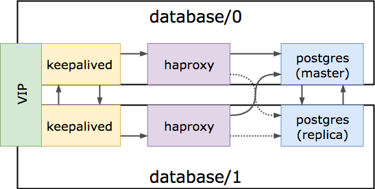

# BOSH Release for postgres

## Usage

To use this bosh release, first upload it to your bosh:

```
bosh target BOSH_HOST
git clone https://github.com/cloudfoundry-community/postgres-boshrelease.git
cd postgres-boshrelease
bosh upload release releases/postgres-1.yml
```

For [bosh-lite](https://github.com/cloudfoundry/bosh-lite), you can quickly create a deployment manifest & deploy a cluster:

```
templates/make_manifest warden
bosh -n deploy
```

For AWS EC2, create a single VM:

```
templates/make_manifest aws-ec2
bosh -n deploy
```

### Override security groups

For AWS & Openstack, the default deployment assumes there is a `default` security group. If you wish to use a different security group(s) then you can pass in additional configuration when running `make_manifest` above.

Create a file `my-networking.yml`:

``` yaml
---
networks:
  - name: postgres1
    type: dynamic
    cloud_properties:
      security_groups:
        - postgres
```

Where `- postgres` means you wish to use an existing security group called `postgres`.

You now suffix this file path to the `make_manifest` command:

```
templates/make_manifest openstack-nova my-networking.yml
bosh -n deploy
```

## High Availability

HA is implemented with automatic failover, if you set
`postgres.replication.enabled` to true.

On bootstrap, if there is no data directory, the postgres job will
revert to a normal, index-based setup.  The first node will assume
the role of the master, and the second will become a replica.

Once the data directory has been populated, future restarts of the
postgres job will attempt to contact the other node to see if it
is a master.  If the other node responds, and reports itself as a
master, the local node will attempt a `pg_basebackup` from the
master and assume the role of a replica.

If the other node doesn't respond, or reports itself as a replica,
the local node will keep trying, for up to
`postgres.replication.grace` seconds, at which point it will
assume the mantle of leadership and become the master node,
using its current data directory as the canonical truth.

Each node then starts up a `monitor` process; this process is
responsible for ultimately promoting a local replica to be a
master, in the event that the real master goes offline.  It works
like this:

  1. Busy-loop (via 1-second sleeps) until the local postgres
     instance is available on its configured port.  This prevents
     monitor from trying to restart the postgres while it is
     running a replica `pg_basebackup`.

  2. Busy-loop (again via 1-second sleeps) for as long as the
     local postgres is a master.

  3. Busy-loop (again via 1-second sleeps), checking the master
     status of the other postgres node, until it detects that
     either the master node has gone away (via a connection
     timeout), or the master node has somehow become a replica.

  4. Promote the local postgres node to a master.

Intelligent routing can be done by colocating the `haproxy` and
`keepalived` jobs on the instance groups with `postgres`.  HAproxy
is configured with an external check that will only treat the
master postgres node as healthy.  This ensures that either load
balancer node will only ever route to the write master.

The `keepalived` node trades a VRRP VIP between the `haproxy`
instances.  This ensures that the cluster can be accessed over a
single, fixed IP address.  Each keepalived process watches its own
haproxy process; if it notices haproxy is down, it will terminate,
to allow the VIP to transgress to the other node, who is assumed
to be healthy.

For backup purposes, a route is exposed through haproxy which
routes directly to the read-only replica for backup jobs. By default
this port is your `port` + 2000, but is also configurable via
`postgres.replication.readonly_port`

Here's a diagram:



The following parameters affect high availability:

  - `postgres.replication.enabled` - Enables replication, which is
    necessary for HA.  Defaults to `false`.

  - `postgres.replication.grace` - How many seconds to wait for
    the other node to report itself as a master, during boot.
    Defaults to `15`.

  - `postgres.replication.connect_timeout` - How many seconds to
    allow a `psql` health check to attempt to connect to the other
    node before considering it a failure.  The lower this value,
    the faster your cluster will failover, but the higher a risk
    of accidental failover and split-brain.  Defaults to `5`.

  - `postgres.replication.readonly_port` - Which port to access the
    read-only node of the cluster. Defaults to `port + 2000`
    (with all set to defaults, that is `7432`)